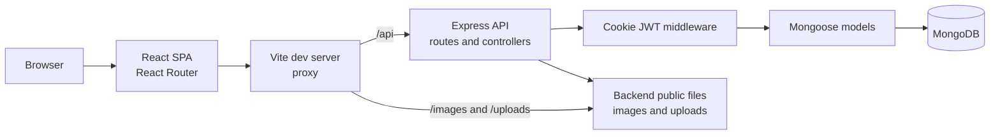
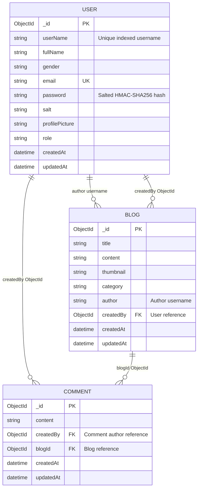

# Inkora

Inkora is a full-stack publishing platform for writers and readers. Members can create an account, publish categorized stories, discover posts, read author profiles, and discuss stories through comments. The application pairs a React single-page frontend with an Express API and MongoDB persistence.

## Features

- Account signup and login using username or email, with a signed JWT stored in a cookie.
- Passwords are stored as per-user salted HMAC-SHA-256 hashes rather than plaintext; login verifies the submitted password against the stored hash.
- A unique index on `userName` supports efficient username lookups and prevents duplicate usernames.
- Author profiles with profile-picture uploads and a paginated list of published stories.
- Story creation with a TinyMCE rich-text editor, category suggestions, and optional thumbnail upload.
- Newest-first story feed with category filtering and paginated results.
- Author search and public author dashboards.
- Individual story pages with author details and comments.
- Story management restricted to the authenticated story owner.
- Responsive React interface with toast feedback, loading states, and draft recovery after login.

## Architecture

The frontend sends same-origin requests to the API. During local development, Vite proxies API and media requests to Express. Express parses cookies and JSON/form data, routes requests to controllers, and uses Mongoose models to read and write MongoDB documents. Uploaded files and static images are served from the backend's `public` directory.



### Request flow

1. React pages request data through Axios and React Router handles client-side navigation.
2. Express mounts user, blog, and comment routes under `/api`.
3. Cookie authentication middleware reads `userToken` and attaches the verified JWT payload to the request when present.
4. Controllers perform validation and business operations through Mongoose.
5. MongoDB stores user, blog, and comment documents; Multer writes uploaded profile pictures and thumbnails to disk.

## Data Model

Inkora uses three Mongoose models. A blog is associated with its author through the `author` username field and also stores a `createdBy` User ObjectId reference. A comment is associated with its author through `createdBy` and with its blog through `blogId`.



| Collection | Purpose | Key relationships |
| --- | --- | --- |
| `users` | Account, profile, role, and password-hash data | `userName` has a unique index for efficient lookups and uniqueness; `email` is also unique; referenced by blog and comment documents |
| `blogs` | Story content, category, thumbnail, and author identity | `author` stores the author's username; `createdBy` references the user document |
| `comments` | Discussion attached to a story | `createdBy` references the comment author; `blogId` references the blog |

All three schemas use Mongoose timestamps. User passwords are never stored as plaintext. On account creation, the user model generates a random 16-byte salt and uses it as the key for an HMAC-SHA-256 password digest. At login, the backend recomputes the digest with the stored salt and compares it with the stored password hash before issuing a JWT cookie. This protects stored credentials from direct disclosure, but SHA-256 is designed to be fast and is not a password-specific hashing algorithm; a production deployment should consider Argon2id, scrypt, or bcrypt.

## Technology Stack

<p align="center">
   
   
   
   
   
   
   
   
   
   
   
   
</p>

Also used: React Hot Toast, `cookie-parser`, and `dotenv`.

## Project Layout

```text
Inkora/
├── Backend/
│   ├── app.js                  # Express app and route mounting
│   ├── controllers/            # User, blog, and comment operations
│   ├── middlewares/            # Mongo connection and cookie auth
│   ├── models/                 # Mongoose schemas
│   ├── public/                 # Static images and uploaded media
│   ├── routes/                 # API route definitions
│   └── services/               # JWT creation and verification
├── Frontend/
│   ├── src/
│   │   ├── Components/         # Shared UI and story editor
│   │   ├── Context/            # Current-user context
│   │   ├── Pages/              # Route-level screens
│   │   ├── App.jsx             # Client-side routes
│   │   └── index.css            # Application styles
│   ├── public/
│   ├── index.html
│   └── vite.config.js          # Development proxy configuration
└── readme.md
```

## API Overview

All API paths are mounted under `/api`.

| Method | Path | Description |
| --- | --- | --- |
| `GET` | `/api` | Return the current authenticated user, if present |
| `POST` | `/api/user/signup` | Create an account; accepts optional `profilePicture` upload |
| `POST` | `/api/user/login` | Sign in with username or email and password |
| `GET` | `/api/user/checkuser/:userName` | Check username availability |
| `POST` | `/api/user/logout` | Clear the authentication cookie |
| `GET` | `/api/blogs?page=1&category=Technology` | Fetch a feed page, optionally filtered by category |
| `GET` | `/api/blogs/:blogId` | Fetch a story and its comments |
| `GET` | `/api/blogs/user/:userName?page=1` | Fetch an author's profile stories |
| `POST` | `/api/blogs/create` | Publish a story; accepts an optional `thumbnail` upload |
| `DELETE` | `/api/blogs/:blogId` | Delete a story if the requester owns it |
| `POST` | `/api/comment/:blogId` | Add a comment to a story |

## Run Locally

### Requirements

- Node.js compatible with Vite 8 (Node.js 20.19+ or 22.12+).
- MongoDB running locally or a MongoDB Atlas connection string.
- A TinyMCE API key for the rich-text editor.

### Install dependencies

Run these commands from the repository root:

```bash
cd Backend
npm install
cd ../Frontend
npm install
```

### Configure the backend

Create `Backend/.env`:

```env
PORT=8001
MONGO_URL=mongodb://127.0.0.1:27017/inkora
SECRET_KEY=replace_with_a_long_random_secret
```

`MONGO_URL` can instead point to a MongoDB Atlas deployment. `SECRET_KEY` signs and verifies the seven-day authentication JWT; keep it private and use the same value across backend restarts.

### Configure the frontend

Create `Frontend/.env` and provide the TinyMCE API key:

```env
VITE_TINYMCE_API_KEY=your_tinymce_api_key
```

### Start the application

Open two terminals from the repository root.

Backend:

```bash
cd Backend
npm run dev
```

Frontend:

```bash
cd Frontend
npm run dev
```

The frontend is available at `http://localhost:5173`; the backend listens at `http://localhost:8001`. Vite proxies `/api`, `/images`, and `/uploads` to the backend during development. Start MongoDB before using the application, and do not commit either `.env` file.

## Build the Frontend

```bash
cd Frontend
npm run build
```